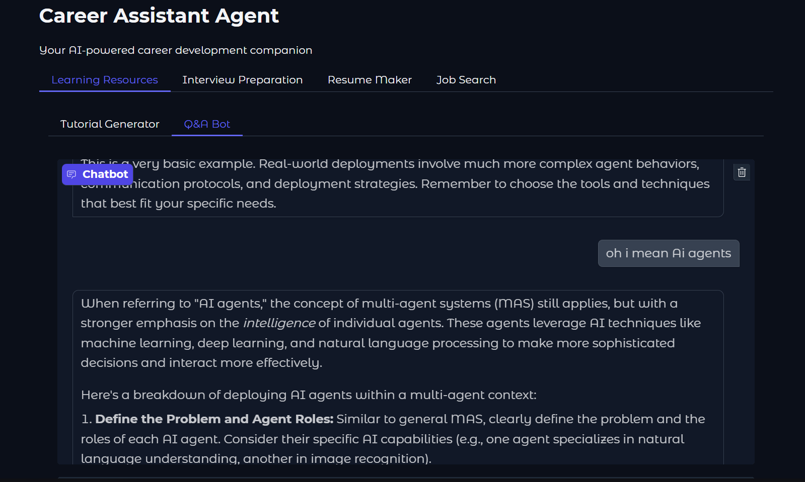

# Career Assistant Agent

An AI-powered career development companion that helps with learning resources, interview preparation, resume creation, and job searching.

## Features

- **Learning Resources**
  - Tutorial Generator: Get detailed tutorials on various tech topics
  - Q&A Bot: Interactive bot for answering your technical questions

- **Interview Preparation**
  - Interview Questions Generator: Get curated interview questions for your target role
  - Mock Interview Simulator: Practice with an AI interviewer

- **Resume Maker**
  - AI-powered resume generator tailored for tech roles
  - Incorporates current industry keywords and best practices

- **Job Search**
  - Smart job search with detailed listings
  - Includes job summaries, requirements, and application links

## Prerequisites

- Python 3.8 or higher
- Google API key for Gemini Pro model / you can change the model in the base_agent.py file by adding your own model

## Installation

1. Clone the repository:
```bash
git clone <repository-url>
cd career-agent
```

2. Create and activate a virtual environment (recommended):
```bash
# Windows
python -m venv venv
venv\Scripts\activate

# Linux/Mac
python3 -m venv venv
source venv/bin/activate
```

3. Install required packages:
```bash
pip install -r requirements.txt
```

4. Set up environment variables:
   - Create a `.env` file in the root directory
   - Add your Google API key:
```env
GOOGLE_API_KEY='your_api_key_here'
```

## Running the Application

Using Python directly:
```bash
python -m app
```

The application will start and be accessible at `http://localhost:7860` in your web browser.

## Usage Guide

### Tutorial Generator
1. Navigate to the "Learning Resources" tab
2. Select "Tutorial Generator"
3. Enter a topic you want to learn about
4. Click "Generate Tutorial"

### Interview Practice
1. Go to the "Interview Preparation" tab
2. Choose between:
   - "Interview Questions" for getting practice questions
   - "Mock Interview" for an interactive interview simulation

### Resume Creation
1. Select the "Resume Maker" tab
2. Enter your professional details including:
   - Skills
   - Experience
   - Education
   - Projects
3. Click "Generate Resume"

### Job Search
1. Go to the "Job Search" tab
2. Enter your desired job title and location
3. Click "Search Jobs"

## Output Files

All generated content (tutorials, interview questions, resumes, job listings) are saved as markdown files in the `Agent_output` directory with timestamps.

## Project Structure

```
career_agent/
├── agents/             # Agent implementations
├── config/            # Configuration settings
├── ui/                # User interface components
├── utils/             # Utility functions
└── app.py            # Main application file
```

## Contributing

1. Fork the repository
2. Create a new branch for your feature
3. Commit your changes
4. Push to your branch
5. Create a Pull Request

## License

This project is licensed under the MIT License - see the LICENSE file for details.

## Troubleshooting

### Common Issues

1. **ModuleNotFoundError**:
   - Make sure you're in the correct directory
   - Verify that all dependencies are installed
   - Check that your virtual environment is activated

2. **API Key Error**:
   - Verify that your `.env` file exists and contains the correct API key
   - Make sure the API key is valid and has necessary permissions

3. **Import Errors**:
   - Ensure you're running the application from the correct directory
   - Check that all required packages are installed

For additional help, please create an issue in the GitHub repository. 